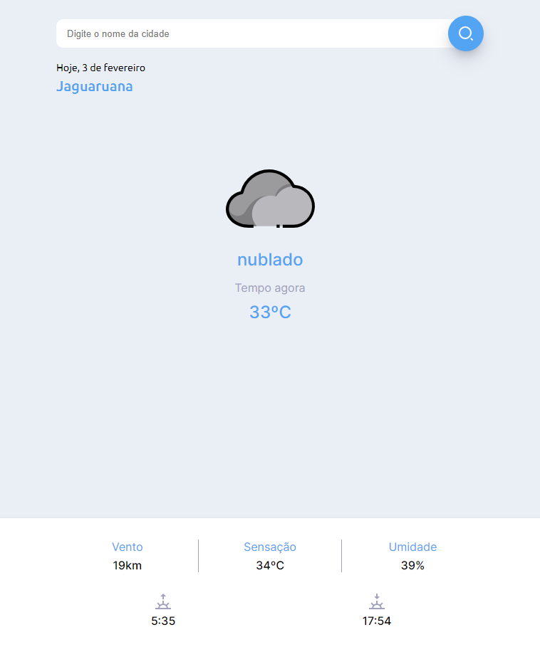

<h1 align="center"> App Day Weather </h1>

App feito com intuito de treinar alguns conhecimentos entre HTML, CSS E JAVASCRIPT e MOBILEFIRST.  

  <a href="#-tecnologias">Tecnologias</a>&nbsp;&nbsp;&nbsp;|&nbsp;&nbsp;&nbsp;
  <a href="#-projeto">Projeto</a>&nbsp;&nbsp;&nbsp;|&nbsp;&nbsp;&nbsp;
  <a href="#memo-licença">Licença</a>

 

  

## 🚀 Tecnologias

Esse projeto foi desenvolvido com as seguintes tecnologias:

- HTML e CSS
- JavaScript
- Git e Github

## 💻 Projeto

O App serve para ver informações do clima como graus, temperatura, vento nascer e pôr do sol.

Você pode acessar o app do projeto através do link - [Visite o projeto online]()

## :memo: Licença

Esse projeto está sob a licença ROL.

---

Feito by Ramirison Oliveira(https://github.com/RamirisonOliveira)